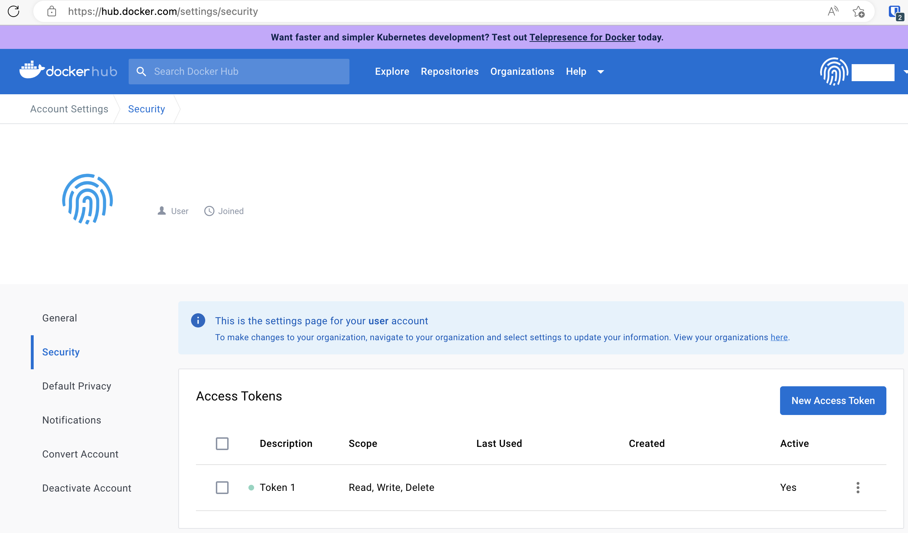

演習2 コンテナイメージのビルド
====================

# この演習の目的
Nginxのコンテナイメージを自分で作成することで、Dockerfileの書き方やコンテナイメージの作成方法を理解します。

通常はNginxがインストール済みのコンテナイメージを利用しますが、今回は練習のためにUbuntuにNginxを自分でインストールしてみます。また、デフォルトで表示されるindex.htmlを差し替えます。

本演習のコマンドは、すべてex02フォルダで実行してください。

```shell
$ cd ex02
```

# 手順
## コンテナイメージのビルド
(1) エディタなどでDockerfileの内容を確認してください。

```Dockerfile
# ベースイメージはUbuntu 20.04
FROM ubuntu:20.04

# タイムゾーンを環境変数で指定
ENV TZ=Asia/Tokyo

    # タイムゾーンを日本に設定
RUN ln -snf /usr/share/zoneinfo/$TZ /etc/localtime \
    && echo $TZ > /etc/timezone \
    # インストール可能なパッケージ一覧を更新
    && apt update \
    # Nginxをインストール
    && apt install -y nginx

# HTMLファイルをコピー
COPY ./contents /var/www/html

# ポート番号80を公開
EXPOSE 80

# コンテナ起動時にNginxを起動させる
CMD ["nginx", "-g", "daemon off;"]
```

(2) 次のコマンドで、コンテナイメージをビルドしてください（build.shに同じコマンドが書いてあります）。

```shell
$ docker image build -t my-nginx:0.0.1 .
[+] Building 38.5s (8/9)
 => [internal] load build definition from Dockerfile                                                                            0.1s
 => => transferring dockerfile: 624B                                                                                            0.0s
 => [internal] load .dockerignore                                                                                               0.1s
 => => transferring context: 2B                                                                                                 0.0s
 => [internal] load metadata for docker.io/library/ubuntu:20.04                                                                 6.8s
 => [auth] library/ubuntu:pull token for registry-1.docker.io                                                                   0.0s
 => [1/3] FROM docker.io/library/ubuntu:20.04@sha256:db8bf6f4fb351aa7a26e27ba2686cf35a6a409f65603e59d4c203e58387dc6b3          31.5s
 => => resolve docker.io/library/ubuntu:20.04@sha256:db8bf6f4fb351aa7a26e27ba2686cf35a6a409f65603e59d4c203e58387dc6b3           0.0s
 => => sha256:88bd6891718934e63638d9ca0ecee018e69b638270fe04990a310e5c78ab4a92 2.30kB / 2.30kB                                  0.0s
 => => sha256:ca1778b6935686ad781c27472c4668fc61ec3aeb85494f72deb1921892b9d39e 27.50MB / 27.50MB                                1.3s
 => => sha256:db8bf6f4fb351aa7a26e27ba2686cf35a6a409f65603e59d4c203e58387dc6b3 1.13kB / 1.13kB                                  0.0s
 => => sha256:b795f8e0caaaacad9859a9a38fe1c78154f8301fdaf0872eaf1520d66d9c0b98 424B / 424B                                      0.0s
 => => extracting sha256:ca1778b6935686ad781c27472c4668fc61ec3aeb85494f72deb1921892b9d39e                                       2.6s
 => [internal] load build context                                                                                               0.0s
 => => transferring context: 290B                                                                                               0.0s
 => [2/3] RUN ln -snf /usr/share/zoneinfo/Asia/Tokyo /etc/localtime     && echo Asia/Tokyo > /etc/timezone     && apt update     && apt install -y nginx          25.4s
 => [3/3] COPY ./contents /var/www/html                                                                                         0.1s 
 => exporting to image                                                                                                          1.7s 
 => => exporting layers                                                                                                         1.7s
 => => writing image sha256:a5c38a77fa51b89ad1c3ca1cdaa5f30c27e6d265f8d2ef68014a7e9b5fc3ffee                                    0.0s
 => => naming to docker.io/library/my-nginx:0.0.1
```

(3) 次のコマンドで、コンテナイメージが作成されたことを確認してください。

```shell
$ docker image ls
REPOSITORY                       TAG                       IMAGE ID       CREATED          SIZE
my-nginx                                          0.0.1     a5c38a77fa51   3 minutes ago   176MB
...
```

## コンテナの起動
(1) 次のコマンドで、コンテナを起動してください（run.shに同じコマンドが書いてあります）。

```shell
$ docker container run --rm -p 8080:80 my-nginx:0.0.1
```

> ログは何も出ません。

(2) ブラウザで http://localhost:8080 にアクセスしてください。サンプルページが表示されれば成功です。

(3) ターミナルでCtrl+Cを押下してください。コンテナが停止します。

## コンテナイメージのアップロード
(1) まだDocker Hubのアカウントを持っていない場合は、 https://hub.docker.com/ から作成してください。

(2) Docker Hubの[アカウント設定画面](https://hub.docker.com/settings/security)で、[Read, Write, Delete]スコープを持つアクセストークンがあるか確認してください。無い場合は[New Access Token]から作成してください。



(3) 次のコマンドで、Docker Hubにログインしてください。 `xxxxxxxx` の部分は自分のDocker Hubユーザー名を入力してください。Passwordには、パスワードではなくアクセストークンを入力してください。

```shell
$ docker login -u xxxxxxxx
Password: 
Login Succeeded
```

(4) 次のコマンドで、コンテナイメージに自分のユーザー名を含むタグを付加してください。 `xxxxxxxx` の部分は自分のDocker Hubユーザー名を入力してください。

```shell
$ docker tag my-nginx:0.0.1 xxxxxxxx/my-nginx:0.0.1
```

(5) 次のコマンドで、先ほど付加したタグを確認してください。コンテナイメージが2つあるように見えますが、1つのイメージに2つのタグが付加されているだけです（ `IMAGE ID` が同じであることから、同一のイメージであることが分かります）。

```shell
$ docker image ls
REPOSITORY                       TAG                       IMAGE ID       CREATED          SIZE
my-nginx                         0.0.1                     4ef5d7a3c65c   27 minutes ago   149MB
xxxxxxxx/my-nginx                0.0.1                     4ef5d7a3c65c   27 minutes ago   149MB
```

(6) 次のコマンドで、コンテナイメージをDocker Hubにアップロードしてください。 `xxxxxxxx` の部分は自分のDocker Hubユーザー名を入力してください。

```shell
$ docker image push xxxxxxxx/my-nginx:0.0.1
The push refers to repository [docker.io/xxxxxxxx/my-nginx]
9e3a75901c15: Pushed 
dc59f64d9a76: Pushed 
6f37ca73c74f: Mounted from library/ubuntu 
0.0.1: digest: sha256:2a2ea59106d5fce30e764f067a6ee30c4d46caa494ba3add6e1504ad7138cdea size: 948
```

(7) ブラウザで https://hub.docker.com/ にアクセスしてください。コンテナイメージ一覧の中にmy-nginxが確認できるはずです。
